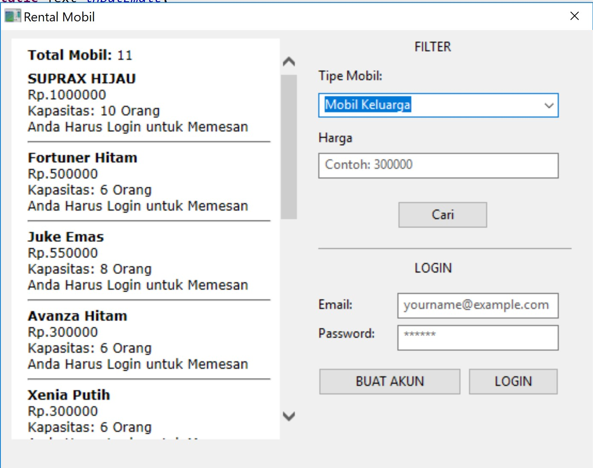

# Car Renting With JAVA & MySQL
> Car renting desktop apps written with JAVA and MySQL

![java-image]
![mysql-image]
![travis-image]

For my semester project. Implementing JAVA GUI and MySQL CRUD in Java, Mixed with HTML Jquery append (using java browser) for displaying data

## External Library

* SWT Library
    * https://www.eclipse.org/swt/
* JxBrowser
    * https://www.teamdev.com/jxbrowser
* Java SQL

## Installation

Import this to your workspace/project, Import the SQL to your localhost sql server, add external library and install all recommendation library, update all db details (user, dbname, password, host) on most of file

<!-- Markdown link & img dfn's -->
[java-image]: https://img.shields.io/badge/Java%20Version-1.8.0-brightgreen.svg
[travis-image]:	https://img.shields.io/appveyor/ci/gruntjs/grunt.svgi
[mysql-image]: https://img.shields.io/badge/MySQL-5.7.23-blue.svg